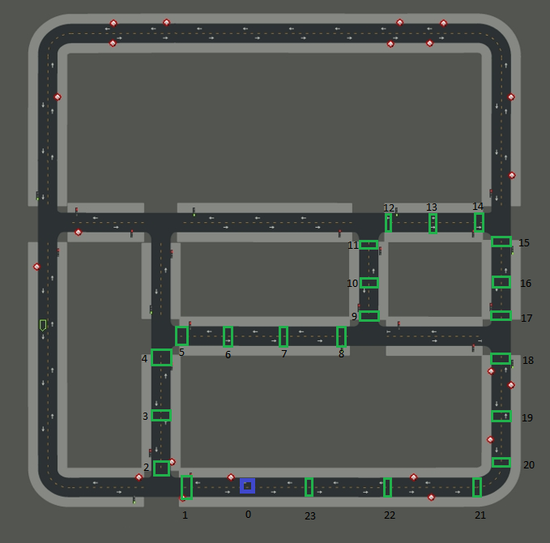

# Autonomous driving via reinforcement learning in the CARLA simulator

In this project reinforcement is used to teach a car how drive a path defined by a series of checkpoints. The CARLA simulator is used as the environment for the car.

|                         | 
|:------------------------------------------------------------------:|
| *The list of checkpoints on the map 'Town02'. Blue is start/ end.* |

The final result of the trained model can be seen in the following [Youtube Video](https://www.youtube.com/watch?v=FE4HvNgfeX4).

## Prerequisites
The program was written with Python 3.7 using the 9.11 version of the CARLA Simulator. All needed modules can be installed running the `run.py` script.

## Running the program
The program expects to be nested in the `PythonAPI` folder in the CARLA folder. 

### Training a model
Run `run.py` to install all needed modules and start the training process. The attribute `load_model_name` in `main.py` can be edited to load an existing model. The value of `None` will create new model. 

### Testing a model
Run the `test_model.py` script to test a model on the defined track. By editing the `load_model_name` in this script, a specific model can be tested. Testing the model for overfitting by going around the track backwards can be done by changing the `REVERSE` flag from `False` to `True`.

## Sources
The basic structure for the main loop and training algorithm comes from this tutorial on [pythonprogramming.net](https://pythonprogramming.net/introduction-self-driving-autonomous-cars-carla-python/)
